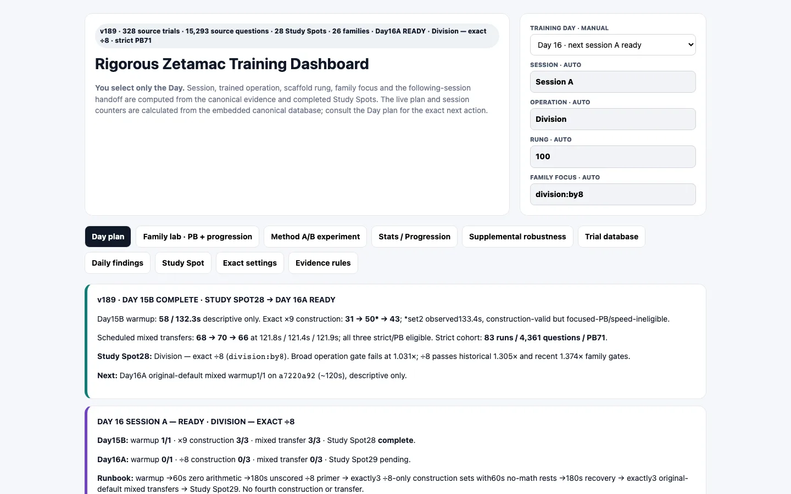
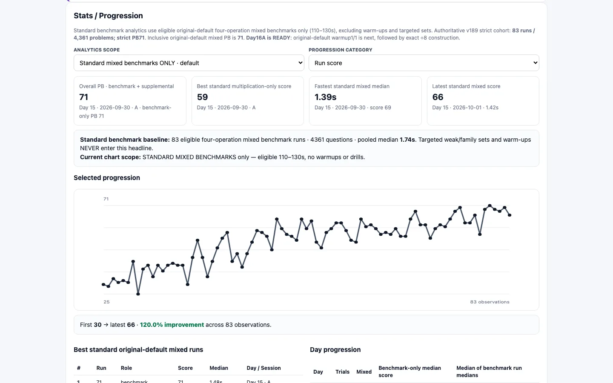
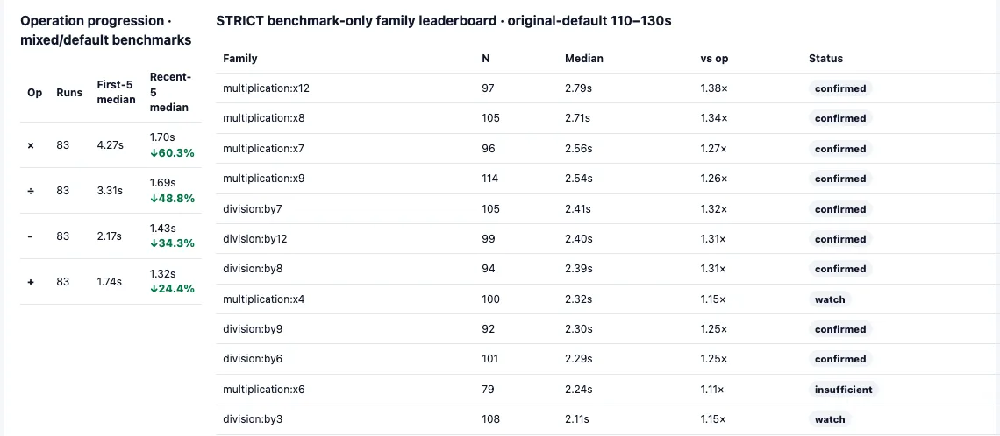

# ZETA

**Live dashboard: [{{PORTFOLIO_URL}}/demos/zeta/]({{PORTFOLIO_URL}}/demos/zeta/)**

A Chrome extension and a dashboard for [Zetamac](https://arithmetic.zetamac.com/),
the 120-second mental-math drill used in trading-interview prep. The extension
times every single problem I answer, and the dashboard decides what I should
drill next. It holds 328 runs and 15,293 individually timed questions.

## Why

Zetamac only tells you a final score. A score of 60 says nothing about whether
you are slow on ×7, on division by 8, or on subtraction with a borrow. I wanted
to see each problem, then train the specific families that are actually slow.

## How it works

1. **The extension watches the page.** A content script observes the problem
   text and the answer box, and timestamps each keystroke. When the problem
   changes, it saves total time, time to first digit, typing time and
   corrections. It never types into the answer box, never calls `eval`, and does
   not change Zetamac's problem generator. It requests no extension permissions.
2. **Every problem gets a family.** 26 families, such as ×2 through ×12, ÷2
   through ÷12, addition with a carry, subtraction with a borrow, plus a
   magnitude bucket.
3. **A run exports as JSON** (`zetamac-trial-log-v1`), by clipboard or download,
   and is appended to the running database in
   [data/zetamac_running_database.json](data/zetamac_running_database.json).
4. **The dashboard gates the evidence.** A family is called weak only after 15
   observations across 2 runs show it at least 1.2 times slower than its
   operation's median. Training focus changes only at a scheduled review after
   three mixed runs, so one noisy run cannot redirect practice.

## Run it

- **Extension:** open `chrome://extensions`, turn on Developer mode, click
  **Load unpacked** and pick the `extension/` folder. Then open
  arithmetic.zetamac.com and play normally. Click **Reset / New Trial** before
  each run, and **Copy trial log** or **Download JSON** after it.
- **Dashboard:** open [dashboard/index.html](dashboard/index.html) in a browser.
  It is one self-contained file with my data built in.

ZETA is an independent tool and is not affiliated with Zetamac.

Joseph Blumberg · josephblumberg325@gmail.com
